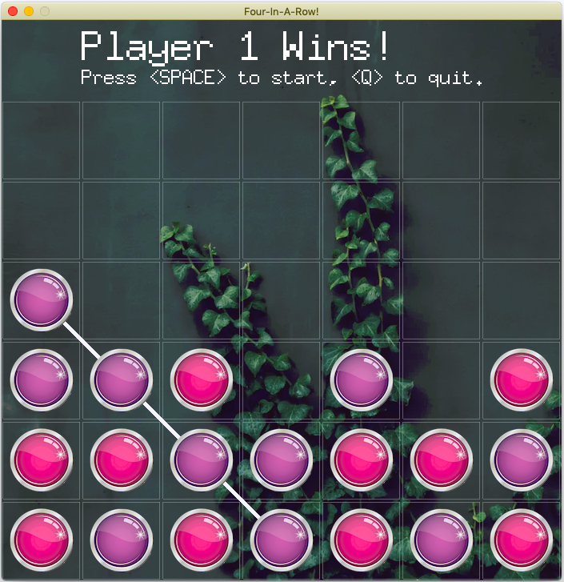
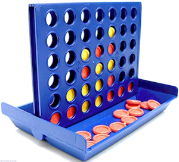

Four In A Row - 2 Player Arcade Game
====================

> Connect Four (also known as Captain's Mistress, Four Up, Plot Four, Find Four, Four in a Row, Four in a Line, Drop Four, and Gravitrips (in Soviet Union)) is a two-player connection game in which the players first choose a color and then take turns dropping one colored disc from the top into a seven-column, six-row vertically suspended grid. The pieces fall straight down, occupying the lowest available space within the column. The objective of the game is to be the first to form a horizontal, vertical, or diagonal line of four of one's own discs.
> 
>  -- [Wikipedia](https://en.wikipedia.org/wiki/Connect_Four)

How to play?
----------------------
- Point the cursor over the column you wish to drop your disc in
- Left click to drop your disc
- When you can connect four discs vertically, horizontally or diagonally you win

Features Implemented/Pending
--------------------
- [x] Basic **Four In A Row** / **Connect Four** game
- [x] Colorful, glossy disc images
- [x] Dice dropping and win sound
- [x] Intro screen with instructions
- [x] Pause screen
- [x] Restart at anytime (from pause screen)
- [ ] Choosing Player name and pawn color
- [ ] Play (move and drop) with keyboard
- [x] Background images using [Unsplash] API
- [x] Change Background in the middle of game (from pause screen)

Development Notes
------------------
To fix any bug, improve or just to explore - 

1. Clone this repo
2. Create `.env` by copying the `.env.dist` file
3. If you don't want to use Unsplash backgrounds, just keep the `UNSPLASH_ACCESS_KEY` empty
4. I Recommend using Unsplash, as it's a huge collection of high quality photos with a totally free API. It's simple!
    - Create your [Developer Account] 
    - Create a *collection* to group up your curated photos. 
    - Set the collection ID as `UNSPLASH_COLLECTION_ID` in `.env` file

Suggestions and [Pull Requests] are welcome!

Motivation
----------------- 
We have a puzzle toy board of Four-In-A-Row and my kids enjoy it very much! One day, they asked to make it a computer game so that they can play it from the MacBook. 

Then, I have searched around for an easy 2D game engine in [Golang] and chosen [Pixel]. Pixel, with it's easy to follow wiki, made it fun to bring this game in existence within a very short time.

---
> O mankind, what has deceived you concerning your Lord, the Generous!  
> -- [Al-Quran 42:6](https://quran.com/82/6?translations=20)

[Unsplash]: https://unsplash.com
[Developer Account]: https://unsplash.com/documentation
[Pull Requests]: https://help.github.com/en/github/collaborating-with-issues-and-pull-requests/about-pull-requests
[Golang]: https://golang.org/
[Pixel]: https://github.com/faiface/pixel
